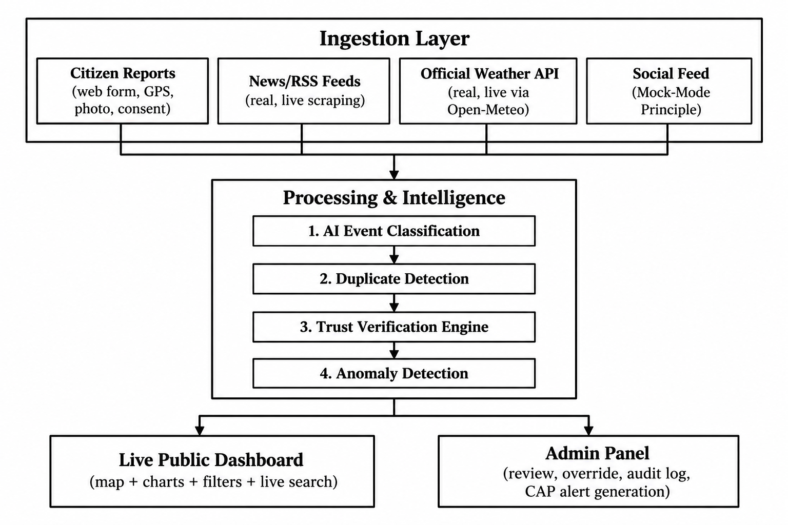

# 🌦️ Mausam Setu — National Weather Big Data Analytics Platform

**Smart India Hackathon 2026 | Problem Statement 26069**

| Field | Detail |
|---|---|
| Organization | Ministry of Earth Sciences (MoES) |
| Department | India Meteorological Department (IMD) |
| Category | Software |
| Theme | Disaster Management |

---

## 📋 Table of Contents

1. [Problem Statement](#-problem-statement)
2. [Our Solution](#-our-solution)
3. [Architecture Overview](#-architecture-overview)
4. [What's Implemented in This Prototype](#-whats-implemented-in-this-prototype)
5. [Module Coverage Checklist](#-module-coverage-checklist)
6. [Technology Stack](#-technology-stack)
7. [Data Sources — Real vs. Mock-Mode](#-data-sources--real-vs-mock-mode)
8. [Trust Verification Scoring](#-trust-verification-scoring)
9. [Anomaly Detection](#-anomaly-detection)
10. [CAP v1.2 Alert Generation](#-cap-v12-alert-generation)
11. [Known Limitations & Scoping Decisions](#-known-limitations--scoping-decisions)
12. [Setup & Run Instructions](#-setup--run-instructions)
13. [API Reference](#-api-reference)
14. [What We Will Do in the Final Project](#-what-we-will-do-in-the-final-project)
15. [Competitive Differentiation](#-competitive-differentiation)
16. [Research & References](#-research--references)

---

## 🎯 Problem Statement

Design and develop a scalable **National Weather Big Data Analytics Platform** capable of collecting and processing real-time weather-related information for India from multiple internet-based sources — social media, public datasets, websites, APIs, and citizen reports.

The platform must:
- Auto-collect weather-related posts (tagged `#IMD` and similar hashtags) with metadata: date/time, city, state, GPS, photos, videos, event category
- Store this centrally using big data / open-source technologies
- Use ML/AI to identify fake or misleading reports, verify untrusted sources, remove duplicates, and auto-categorize events: **Rainfall, Thunderstorm, Flooding, Heatwave, Fog, Dust Storm, Strong Wind**
- Provide a web dashboard + Admin Panel with date/event/location filtering, verification-status tracking, and real-time visualization

---

## 💡 Our Solution

**Mausam Setu** ("Weather Bridge") is an AI-verified citizen weather intelligence platform that bridges informal, real-time public weather signals (social media, news, citizen reports) with IMD's official data — using an **explainable trust-scoring engine** to separate signal from noise, and surfacing both individual verified events and **aggregate anomaly patterns** on a live national dashboard.

**Important positioning note:** This is **not** a forecasting app — IMD's own Mausam App already does that. This is a **crowd-data curation and verification layer**: the missing piece between raw public chatter and actionable, trustworthy disaster intelligence. It's designed to complement, not replace, IMD's existing radar/satellite infrastructure and the ongoing Mission Mausam initiative.

---

## 🏗️ Architecture Overview

```
┌─────────────────────────── INGESTION LAYER ───────────────────────────┐
│  Citizen Reports   │   News/RSS Feeds   │  Official Weather API │ Social Feed │
│  (web form, GPS,   │  (real, live       │  (real, live via      │ (Mock-Mode  │
│   photo, consent)  │   scraping)        │   Open-Meteo)         │  Principle) │
└──────────┬──────────────────┬──────────────────┬──────────────────┬─────────┘
           └──────────────────┴──────────────────┴──────────────────┘
                                      │
                     ┌────────────────▼────────────────┐
                     │   PROCESSING & INTELLIGENCE      │
                     │  1. AI Event Classification      │
                     │  2. Duplicate Detection           │
                     │  3. Trust Verification Engine     │
                     │  4. Anomaly Detection              │
                     └────────────────┬─────────────────┘
                                      │
                     ┌────────────────▼─────────────────┐
                     │          OUTPUT LAYER             │
                     │  Live Public Dashboard (map +     │
                     │  charts + filters + live search)  │
                     │  Admin Panel (review, override,   │
                     │  audit log, CAP alert generation) │
                     └────────────────────────────────────┘
```

---
<h2>System Architecture</h2>

<p align="center">
  
</p>

## ✅ What's Implemented in This Prototype

### Ingestion (all three sources built, tested, and confirmed live)
- **Citizen Reports** — public submission form with GPS, photo/video upload, consent checkbox, rate-limited (10/IP/minute)
- **News/RSS Scraper** — real, live scraping of Google News (India Weather search), The Hindu, and Indian Express feeds; resolves city/state locally via a 300-city lookup table (no paid geocoding)
- **Official Ground-Truth Puller** — real, live data from the **Open-Meteo** free API (no key required), with OpenWeatherMap as an optional secondary provider; covers 32 major Indian cities on a polling cycle
- **Simulated Social Feed** — built on the **Mock-Mode Principle** (see below); a `SocialFeedClient` with a real, swappable interface, currently running on a curated 199-post labeled replay dataset (160 realistic + 39 deliberately implausible/anomalous, for verification testing)

### Processing & Intelligence
- **Event Classification** — hybrid keyword-rule + TF-IDF/Logistic-Regression ML model, tags every report into one of the 7 required categories, with a confidence score (never silently returns "unknown")
- **Duplicate Detection** — sentence-embedding similarity (all-MiniLM-L6-v2) merges near-duplicate reports of the same event in the same city/time window
- **Trust Verification Engine** — explainable, multi-factor scoring (source credibility + corroboration + official cross-match + media plausibility) → VERIFIED / PENDING / SUSPICIOUS (full formula below)
- **Anomaly Detection** — rolling per-(city, event-type, time-window) report count flags unusual spikes as WATCH/ALERT signals, broadcast live via WebSocket, surfaced as a dashboard badge

### Dashboard & Admin
- **Live public map dashboard** — India map, color-coded by event type, styled by verification status, live WebSocket updates, hazard filter bar, date/status filters
- **Map location search** — instant local lookup (reusing the 300-city ingestion table) that pans/marks any Indian city, whether or not it has active report data, without any external geocoding API call
- **Live Intelligence Feed** — real-time scrolling list of incoming reports with search
- **Analytics charts** — event distribution by hazard type, verification pipeline status
- **Admin Panel** — token-gated access, PENDING/SUSPICIOUS review queue with full factor-breakdown display, approve/reject/mark-duplicate actions, audit log
- **CAP v1.2 XML alert generation** — generates OASIS Common Alerting Protocol-compliant alert documents from VERIFIED events, viewable/downloadable in the Admin Panel (generation and display only — no real SMS/email dispatch)

### Infrastructure
- Python (FastAPI, SQLAlchemy) backend + React (Vite, Tailwind, Leaflet, Recharts) frontend
- **SQLite** database (WAL mode) — no Docker, no external database server; runs with plain `pip install` / `npm install`
- Backend preloads ML models at startup (fixed cold-start latency issue that caused first-request timeouts)
- Seed script populates realistic demo data so the dashboard is never empty

---

## 📊 Module Coverage Checklist

| # | Module | Status | Notes |
|---|---|---|---|
| 1 | Data Source Management | ✅ Implemented | 4 parallel ingestion sources |
| 2 | IMD/API Integration | ✅ Implemented | Open-Meteo (live) + optional OpenWeatherMap |
| 3 | Historical Dataset Processing | 🟡 Partial | Seed data used; formal historical dataset ingestion planned for final project |
| 4 | Data Cleaning & Normalization | ✅ Implemented | Local city/state lookup + schema validation on ingest |
| 5 | Big Data / Streaming | 🟡 By design | Monolith architecture, deliberately not Kafka/streaming for hackathon reliability — architected to be streaming-ready |
| 6 | Weather Event Classification | ✅ Implemented | Hybrid keyword + ML (TF-IDF + Logistic Regression) |
| 7 | AI Verification | ✅ Implemented | Explainable multi-factor trust scoring engine |
| 8 | Duplicate Detection | ✅ Implemented | Sentence-embedding similarity |
| 9 | Anomaly Detection | ✅ Implemented | Rolling spike detection per city/event-type/hour |
| 10 | Backend & Database | ✅ Implemented | FastAPI + SQLAlchemy + SQLite |
| 11 | Authentication & RBAC | 🟡 Partial (token-based admin gate) | Full per-user RBAC planned for final project |
| 12 | National Dashboard | ✅ Implemented | Live map, filters, charts, search |
| 13 | GIS / India Map | ✅ Implemented | Leaflet + OpenStreetMap tiles |
| 14 | Citizen Reporting | ✅ Implemented | Web form with GPS, media, consent |
| 15 | Admin + Alerts | ✅ Implemented | Admin panel + CAP v1.2 XML generation |

---

## 🛠️ Technology Stack

| Layer | Technology |
|---|---|
| Backend | Python, FastAPI, SQLAlchemy, SQLite (WAL mode), native WebSockets |
| Frontend | React, Vite, Tailwind CSS, Leaflet.js, Recharts |
| Event Classification | TF-IDF + Logistic Regression, hybrid with keyword rules |
| Duplicate Detection | Sentence-Transformers (all-MiniLM-L6-v2) |
| Verification Engine | Custom rule-based multi-factor scoring |
| Mapping | Leaflet + OpenStreetMap tiles (via CARTO Basemaps, free tier) |
| Alert Standard | OASIS Common Alerting Protocol (CAP) v1.2 XML |
| Infra | No Docker, no Kafka/microservices — single local-first monolith by deliberate design |

---

## 📡 Data Sources — Real vs. Mock-Mode

| Source | Status | Detail |
|---|---|---|
| Official weather readings | 🟢 **Real** | Open-Meteo free API, live, 32 cities |
| News/RSS | 🟢 **Real** | Google News, The Hindu, Indian Express |
| Citizen reports | 🟢 **Real** | Live submissions via app/web form |
| Social media | 🟡 **Mock-Mode** | See below |

### The Mock-Mode Principle
X/Twitter's API now costs **$200–$5,000/month** with no viable free tier for meaningful social-media ingestion. Rather than skip this data source entirely, we built a **real, swappable client interface** (`SocialFeedClient.fetch_recent(hashtag)`). Today, with no `TWITTER_BEARER_TOKEN` set, it runs on a curated 199-post labeled replay dataset. If a bearer token is ever provided (e.g. licensed API access in production), the exact same function call transparently switches to the live API — **zero code changes elsewhere in the system.** Every mock-mode item is clearly tagged `sourceMeta.simulated = true` and visibly badged `(Simulated Feed)` in the dashboard — never presented as real data.

---

## 🔐 Trust Verification Scoring

Every report receives a fully explainable score — never a single opaque number:

```
sourceTrust:        Official Station = 100 | News/RSS = 75 | Citizen = 50 | Social (simulated) = 40
corroborationBoost:  +5 per independent matching report in same city within 3h, capped at +30
crossMatchOfficial:  matches real official reading → +15 | contradicts it → −40 | no data → 0
imageCheck:          plausible EXIF/timestamp on media → +10 | implausible → −10 | none → 0

Final Trust Score = sum, clamped 0–100
  ≥ 70  → VERIFIED
  40–69 → PENDING (human review queue)
  < 40  → SUSPICIOUS
```

The full factor breakdown is visible to admins reviewing any event — this is a deliberate design choice, since a black-box score cannot be trusted or defended by a human moderator or a disaster-management official.

---

## 🔺 Anomaly Detection

Distinct from per-report verification: even if individual reports are only PENDING, a **sudden cluster** of same-type reports in one place is itself a signal worth surfacing immediately.

- Rolling count of reports per **(city, event type)** within a configurable window (default 3 hours)
- **5+ reports** → WATCH signal | **10+ reports** → ALERT signal
- Only counts VERIFIED/PENDING reports (excludes SUSPICIOUS/REJECTED/DUPLICATE, since those shouldn't drive a real-world alert)
- Broadcast live over the existing WebSocket connection and shown as a dashboard badge/toast

This directly serves the PS's "real-time visualization and analytics" requirement at the aggregate level, not just the per-report level.

---

## 📜 CAP v1.2 Alert Generation

From any **VERIFIED** event, an admin can generate a standards-compliant **OASIS Common Alerting Protocol v1.2** XML document — the same format real emergency-alert systems (like those used by NDMA) consume.

- Maps event data to CAP fields: `urgency`, `severity`, `certainty`, `headline`, `description`, `instruction`, `areaDesc`, geographic circle
- Severity/urgency/certainty derived from trust score, source type, and corroboration count
- Displayed and downloadable in the Admin Panel, with a full alert history/audit trail
- **Clearly labeled as generation-only** — this prototype does not perform real SMS/email dispatch; it demonstrates the correct standardized output format that a production system would feed into a real alert-broadcast pipeline

---

## ⚠️ Known Limitations & Scoping Decisions

Stated openly, not hidden:

- **Language support:** English + a Hindi keyword layer only. Full support for India's 22 official languages is a phased future rollout, not attempted in this prototype.
- **Image authenticity:** basic EXIF-presence + timestamp-plausibility check only ("v1 signal"). Deep forensic/deepfake detection is documented future work.
- **Admin access control:** a single shared token gate, not full per-user role-based access control (RBAC).
- **Social media ingestion:** runs on Mock-Mode (see above) due to the real, current cost of Twitter/X API access.
- **Architecture:** a deliberate single-process monolith (SQLite, no Docker, no Kafka/microservices) chosen for hackathon reliability and one-command reproducibility — architected to be extensible toward a distributed/streaming setup at production scale, not built as one now.
- **Historical dataset ingestion:** currently uses seeded demo data rather than a formally sourced historical weather-event dataset.

---

## 🚀 Setup & Run Instructions

No Docker required — plain Python/Node commands only.

```bash
# Backend
cd backend
python -m venv venv
source venv/bin/activate        # Windows: venv\Scripts\activate
pip install -r requirements.txt
uvicorn main:app --reload
python seed_demo_data.py        # run once, after first startup

# Ingestion (in separate terminals, backend must be running)
cd ingestion
python news_rss_scraper.py --interval 45
python official_puller.py --interval 180
python social_simulated_feed.py --loop --rate 5

# Frontend
cd frontend
npm install
npm run dev
```

**Environment variables (all optional — the system works out-of-the-box with zero keys):**

| Variable | Purpose |
|---|---|
| `ADMIN_TOKEN` | Required header value for Admin Panel access |
| `OPENWEATHER_API_KEY` | Optional secondary official-data provider |
| `TWITTER_BEARER_TOKEN` | Optional — switches social feed from Mock-Mode to live API |
| `BACKEND_URL` | Ingestion scripts' target backend, default `http://localhost:8000` |

---

## 🔌 API Reference

```
POST   /api/v1/reports/citizen              → submit a citizen report
POST   /api/v1/ingest/internal               → internal ingestion (RSS/official/social)
GET    /api/v1/events                        → filterable event list
GET    /api/v1/events/:id                    → single event with full factor breakdown
GET    /api/v1/analytics/summary             → dashboard stat cards
GET    /api/v1/analytics/anomalies           → current anomaly signals
POST   /api/v1/admin/events/:id/override     → admin verification override (token-gated)
POST   /api/v1/admin/events/:id/generate-alert → generate CAP XML alert (token-gated)
GET    /api/v1/admin/alerts                  → alert history
GET    /api/v1/admin/audit-log               → admin action audit log
WS     /ws/live                              → live event + anomaly broadcast
```

---

## 🔮 What We Will Do in the Final Project

| Area | Planned Upgrade |
|---|---|
| Authentication | Full per-user RBAC (replacing the shared admin token) — likely via a managed auth provider |
| Social data | Add a real, free second social source (e.g. Reddit via PRAW) alongside Mock-Mode, and pursue licensed/partnership-based access to a live social API for production |
| Language coverage | Phased rollout beyond English + Hindi toward broader Indian-language NLP support |
| Image verification | Move beyond EXIF checks toward deeper media forensics |
| Historical data | Formal ingestion of a real historical weather-event dataset (e.g. via Kaggle or an official archive), not just seed data |
| Scale | Evaluate a move toward a streaming architecture (Kafka-style) and a hosted, horizontally-scalable database if pilot deployment volume requires it — the current architecture is designed to make this transition additive, not a rewrite |
| Alerts | Move from CAP XML generation/display to a real integration point with an actual emergency-broadcast/dispatch system |
| Deployment | Move from a local SQLite/monolith setup toward a properly hosted deployment (e.g. cloud-hosted Postgres, containerized services) suitable for a real multi-user, always-on pilot |

---

## 🏆 Competitive Differentiation

Existing IMD tools (Mausam App, Damini lightning-alert app, Meghdoot agromet app) are **one-way broadcast systems** — official data flowing out, with zero citizen-input or social-media ingestion. Mausam Setu's core differentiation is combining, in one working system:

- Real multi-source ingestion (not just official broadcast)
- An **explainable**, not opaque, verification engine
- Duplicate detection
- **Aggregate-level anomaly detection** (not just per-report checks)
- **CAP-standard alert output** — tying results to a real emergency-alert format

No comparable hackathon prototype reviewed during our research combined all of these in one working build.

---

## 📚 Research & References

- IMD **Mausam App** — [mausam.imd.gov.in](https://mausam.imd.gov.in)
- IITM Pune **Damini App** — lightning-strike alert system
- IMD **Climate Hazard & Vulnerability Atlas** — [imdpune.gov.in/hazardatlas](https://imdpune.gov.in/hazardatlas)
- **CrisisNLP / CrisisMMD / AIDR** — academic frameworks and datasets for crisis-related social media classification
- IIT Kharagpur (WWW'18) — algorithmic filtering of fake social media posts during real-world disasters
- **OASIS Common Alerting Protocol (CAP) v1.2** — international emergency-alert XML standard
- **Mission Mausam** (Ministry of Earth Sciences) — national radar-expansion and panchayat-level forecasting initiative this platform is designed to complement
